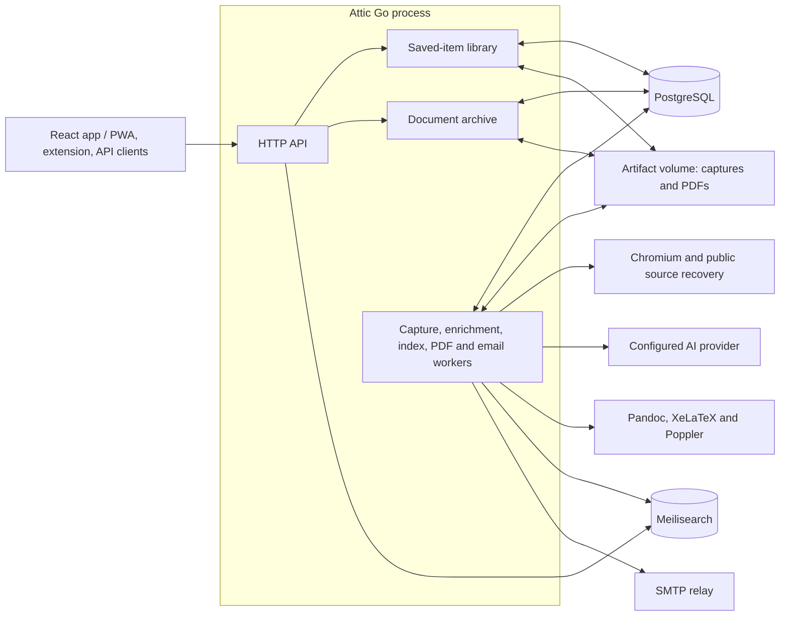

# Attic

Attic is where I store things that I might need later. Save web bookmarks and PDFs,
preserve page snapshots, search the whole collection, and send reading documents
to Kindle Scribe. Bookmarking archives without emailing; **Send to Kindle** also
saves the item and requests delivery.

## Run the personal archive

Copy `.env.example` to `.env` and follow the [development configuration](#development-deployment)
below, including `VALIDATION_DB_PASSWORD` and the matching `DATABASE_URL`. Set
the owner access key, AI provider and a random `MEILI_MASTER_KEY`. To start the
development database, application and private search index, run:

```sh
docker compose -p attic-validation -f compose.yaml -f compose.dev.yaml -f compose.search.yaml up -d --build
```

Open `http://<server-address>:18080/`. Existing articles are adopted without refetching
or resending their PDFs. Capture, AI classification, indexing and Kindle preparation
run independently. Search needs the external index; an unavailable index leaves saving
and existing documents usable. See [search setup](docs/search.md).

Enable **Automatically save browser bookmarks** in the Chromium extension's options to ingest existing
bookmarks and follow new bookmarks, edits and folder moves. It catches up after outages.
Removing a browser bookmark never deletes its Attic copy. Explicit Attic deletion also
prevents routine browser reconciliation from reimporting it. HTML import is available
for bookmark exports from other browsers. PDF uploads preserve their original bytes;
image-only PDFs remain searchable by filename and annotations, without OCR.

The reader exposes capture versions, annotations, tags, and processing status.
AI-suggested tags are added to the editable tags; the API also retains the original
suggestions and missing-resource details. Failed classification can be retried
through the item enrichment API. A successful capture remains available if a later capture fails.

Use the pencil beside the reader title to rename a saved item; browser bookmark
sync preserves that edit. In the reader sidebar, choose a language and **Translate**
to prepare a separate reading edition and PDF. English is the default; Spanish,
French, German, Italian, Portuguese, Dutch, Japanese, Korean and Chinese are also
available. **Original** switches back, and **Original layout** always opens the
preserved capture. Translation uses the configured AI provider, passes normal
article approval and PDF checks, and does not request email. **Send to Kindle**
uses the selected edition. Uploaded PDFs retain their original bytes and cannot
be translated through this article workflow.

Choose **Edit reading version** in the reader sidebar to change the cleaned
article, then **Save and generate PDF**. Attic sanitizes the edited HTML and
queues a new PDF without AI rewriting. Earlier captures and PDFs remain stored;
concurrent edits are rejected if the reading revision has changed.

**Export archive** downloads a portable ZIP of saved records, capture versions, PDFs,
approved reading content and browser deletion records. **Restore archive** merges it
without overwriting newer local edits, recapturing pages or sending email, and schedules
reindexing. Export streams without using the small browser tmpfs; restore stages a private
ZIP on the artifact volume. Restore limits: 16 GiB per archive, 128 MiB per member and
100,000 ZIP entries. The ZIP does not contain credentials or full operational job history;
keep database/volume backups below for complete deployment recovery.

## Architecture and navigation

The domain terms are defined in [CONTEXT.md](CONTEXT.md).
`internal/domain` owns job stage transitions and safe failure categories/messages;
the memory and PostgreSQL adapters enforce those rules while owning their lease
and storage mechanics. A new failure category belongs in that domain policy,
with a persistence check covering both adapters.

`ui/src` owns the React library, reader and settings. The `Archive` interface in
`ui/src/archive/contract.ts` separates screens from HTTP transport and the local
preview adapter. `internal/httpapi/frontend.go` serves the built application;
`internal/httpapi/web` contains the browser connection guide.

`cmd/attic` wires these modules into one Go process. Workers claim durable work
from PostgreSQL; there is no separate message broker. Capture, classification,
indexing, PDF preparation and email delivery have independent outcomes.



PostgreSQL and the artifact volume are canonical; Meilisearch is rebuildable.
Bookmarking queues preservation without email. PDF preparation first uses saved
content when available; sending requests delivery of the selected reading edition.
See the [schema relationships](migrations/README.md#saved-items-and-reading-documents)
and [browser recovery](docs/browser-recovery.md) for those boundaries in more detail.

## Email delivery

Enable `SMTP_ENABLED=true` to deliver explicit **Send to Kindle** requests to
`SMTP_DESTINATION`. Configure `SMTP_HOST`, `SMTP_PORT`, `SMTP_SENDER`, and optional
`SMTP_USERNAME`/`SMTP_PASSWORD`. Use `SMTP_TLS_MODE=starttls` (normally port 587)
or `implicit_tls` (normally 465); certificates are verified. The default timeout
is `SMTP_TIMEOUT=30s`. For Kindle delivery, use your Send to Kindle address and
add the sender to your Amazon approved personal document email list.

The PDF stays available in the library. Bookmarking and importing do not email anything. Delivery requests save the intended
recipient and reuse existing PDFs, or queue document preparation when necessary. Temporary
failures retry up to three times with backoff. Rejections and unconfirmed delivery
show **Retry delivery**, which sends the saved PDF without rerunning AI or formatting.
A lost acknowledgement or expired delivery lease is not automatically retried:
the relay may already have accepted it. Manual retry can therefore send a duplicate.
“Email Sent” means the relay accepted the email, not that the device downloaded it.

The delivery module owns SMTP, MIME attachments, deadlines and safe outcome
classification. The PostgreSQL adapter owns atomic queue claims, attempt history
and retry scheduling. This seam keeps email failures out of article processing.

### Catch email locally

The optional mail-test Compose override routes mail to
[Mailpit](https://mailpit.axllent.org/docs/install/docker/), an SMTP catcher that
keeps messages locally. Run:

```sh
docker compose -p attic-validation -f compose.yaml -f compose.dev.yaml -f compose.search.yaml -f compose.mail-test.yaml up -d --build
```

Open `http://<server-address>:18025/` to inspect messages and download attachments.
Use **Send to Kindle** through Attic on port 18080; its email appears after PDF
preparation succeeds. The SMTP port is internal to Compose. This development
configuration uses test addresses, no authentication and explicit
`SMTP_TLS_MODE=none`; it does not forward mail to a real mailbox. Its web inbox
is visible on the local network and messages are disposable on container replacement.
The base Compose configuration leaves delivery disabled unless enabled in `.env`.

To stop testing email while keeping Attic running:

```sh
docker compose -p attic-validation -f compose.yaml -f compose.dev.yaml -f compose.search.yaml up -d --no-deps attic
docker compose -p attic-validation -f compose.yaml -f compose.dev.yaml -f compose.mail-test.yaml rm -sf mailpit
```

## Chromium extension

Download **Chromium extension** from Settings, unzip it, and load its `attic` folder
at `chrome://extensions` with Developer mode enabled. For updates, replace the
files in the existing unpacked folder and click Reload.

Type `a`, press Tab, then enter a search in the address bar. Matching saved items
come from your configured Attic server; select one to open its reader, or press
Enter for the full library search. This uses [Chromium’s omnibox keyword mode](https://developer.chrome.com/docs/extensions/reference/api/omnibox)
and the extension’s existing server connection; normal address-bar typing is not sent.

Connect with your server address and Attic access key in the extension's Options,
then pin **Save to Attic**. Current-page saves upload a browser snapshot when
possible; linked pages and bookmark imports use server capture. Both preserve a
saved item, and only **Send to Kindle** requests email.
See [installation and permissions](internal/httpapi/extension/README.md).

## Prerequisites

- Linux with Docker Engine and Compose v2 (or another OCI-compatible runtime).
- An existing PostgreSQL 14+ instance reachable through `DATABASE_URL`.
- A persistent volume for `/data`.
- Outbound HTTPS access to submitted sites and the configured AI provider.
- HTTPS termination at a trusted reverse proxy or at the application.

The base Compose file uses external PostgreSQL; `compose.dev.yaml` supplies a
database for development.

## Setup

Run commands from the repository root. Copy `.env.example` to `.env`, restrict
its permissions with `chmod 600 .env`, and edit the database, bearer token and AI
settings before starting Compose. Generate a bearer token with
`openssl rand -hex 32`. If PostgreSQL runs directly on the Docker host, use
`host.docker.internal` as its hostname. For a bundled development database,
use the development deployment below.

## Build

### ChatGPT subscription login

Attic can call the ChatGPT Codex backend directly using subscription OAuth.
It does not invoke Codex, OpenCode, or another agent process. This integration
follows the observed third-party protocol described in
[the research note](docs/chatgpt-subscription-access.md); it is not the
public Platform API, and available models and usage limits depend on your
ChatGPT account.

Set these values in `.env`:

```dotenv
AI_PROVIDER=chatgpt
CHATGPT_AUTH_FILE=/data/auth/chatgpt.json
AI_MODEL=gpt-5.6-luna
```

`AI_API_KEY` and `AI_BASE_URL` are unused in this mode. Keep `AI_MODEL` set to a
model available to your subscription. To use the existing API-key provider,
set `AI_PROVIDER=api` and configure those API fields.

Build the image and start the native device login command:

```sh
docker compose -f compose.yaml build attic
docker compose -f compose.yaml run --rm --no-deps attic login-chatgpt
```

Open the printed OpenAI verification URL, enter the displayed code, and sign
in. Device authorization may need enabling in your ChatGPT account security
settings or workspace permissions. Login expires after 15 minutes and can be
cancelled with Ctrl-C. It requires no database or API-key configuration.

The command saves Attic's own tokens under `/data/auth` with owner-only file
permissions. The worker refreshes them automatically, serializes refresh across
processes, and atomically saves rotated tokens. It never imports another
application's credentials. Protect backups of `/data`, which now include these
credentials. If authentication is revoked, rerun `login-chatgpt`.

```sh
docker compose -f compose.yaml run --rm --no-deps attic check-ai
docker compose -f compose.yaml up -d
```

For the development deployment below, add
`-p attic-validation -f compose.dev.yaml` after the base `-f` option in
each command. Login and the worker must use the same project and data volume.
Readiness does not require a logged-in AI provider; `check-ai` explicitly
verifies credentials, image input, and the article-response protocol.

### Development deployment

`compose.dev.yaml` adds an isolated PostgreSQL container and publishes
Attic on all interfaces at port `18080`, for machines where port 8080 is occupied.
Open `http://<server-address>:18080/` from another device on your private network.
Use it with the base Compose file, from this directory:

```sh
docker compose -p attic-validation -f compose.yaml -f compose.dev.yaml up -d --build
curl -fsS http://127.0.0.1:18080/health/ready
docker compose -p attic-validation -f compose.yaml -f compose.dev.yaml run --rm attic check-ai
```

Before starting, configure the ignored `.env` with the normal AI and bearer
settings, `PUBLIC_BASE_URL` set to the address you will use to reach Attic, a random
`VALIDATION_DB_PASSWORD`, and a matching
`DATABASE_URL=postgres://attic:<password>@validation-db:5432/attic?sslmode=disable`.
Use a URL-safe password, such as a randomly generated hexadecimal string.
PostgreSQL is reachable only on the Compose network and retains its data in
`attic-validation-postgres`. This local override is separate from the supported
external-PostgreSQL deployment. Use the same two Compose files and project name
for logs, updates, and shutdown.

The base file fixes the artifact volume name to `attic-data`, so changing the
Compose project name does not isolate artifacts or stored browser/auth profiles.
Use a volume override for a fully separate deployment. Include `compose.search.yaml`
and `MEILI_MASTER_KEY` when you also want search, as in the quick start.

A successful readiness response verifies local dependencies; it does not prove
AI access. If `check-ai` fails because the provider account has no credit,
fund the account or update the AI credentials before attempting an article.
After changing `.env`, rerun `up -d` to recreate the application with the new
configuration. A successful article must reach `ready` and yield a PDF through
`GET /api/v1/jobs/{id}/artifact` with the owner bearer token.

### Build the image directly

Run these commands from this directory:

```sh
cp .env.example .env
$EDITOR .env
docker build --file Dockerfile --tag attic:latest .
```

The multistage build bundles the React UI, embeds it in a static Go binary,
and copies the binary and migrations into the runtime image. The runtime stage places the migration SQL at
`/app/migrations` and removes its write permissions; the migration runner
consumes that directory. The build context excludes credentials, local data, and tests.

The base image tags are intentionally pinned (`golang:1.24.6-alpine3.22` and
`alpine:3.22.1`). Update them as a deliberate image-maintenance change.

## Configure and start

Copy `.env.example` to `.env`, then replace every `replace-` value. Never
commit `.env`, put credentials in command-line arguments, or bake secrets into
the image. Use mounted secret files when supported by the deployment.

Important settings include:

- `DATABASE_URL`: the existing PostgreSQL 14+ connection string;
- `BEARER_TOKEN`: the one-owner bearer credential;
- `ARTIFACT_ROOT=/data/artifacts`;
- `AI_PROVIDER`, `CHATGPT_AUTH_FILE` for subscription login, or `AI_BASE_URL`
  and `AI_API_KEY` for API access; `AI_MODEL` selects the model;
- `AI_REASONING_EFFORT=medium`, which may be disabled for providers that reject
  the optional parameter.

Submitted page content and bounded screenshots are sent
to the explicitly configured AI provider; review that data flow before
supplying the provider key.

Start Attic with Compose:

```sh
docker compose -f compose.yaml up -d --build
docker compose -f compose.yaml logs -f attic
```

The service binds to `127.0.0.1:8080` in the example so a reverse proxy or
private network can provide external HTTPS. The container runs as UID/GID
`10001`, drops Linux capabilities except `SYS_ADMIN` and `SYS_CHROOT`, which
Chromium needs while establishing its namespace/setuid sandbox, and has a
read-only root filesystem. Do not enable `no-new-privileges` or pass Chromium
`--no-sandbox`. Only `/data`, `/tmp`, and `/dev/shm` are writable.
Chromium handles acquisition with its process sandbox enabled. PDFs are typeset
by Pandoc and XeLaTeX using Latin Modern fonts with a subtle stroke-weight
increase (`FakeBold=0.35`) for e-ink readability. All subprocesses run as the same
non-root user under CPU, memory, and PID limits. The formatter uses sanitized
HTML, a private template, disabled TeX shell escape, restricted TeX file access,
a deadline, and a bounded output file.

Set `PDF_PROFILE=kindle-scribe` for a 157.5 × 210 mm (3:4) portrait page, with
12 mm margins, 11 pt body text and smaller, wrapping monospaced code. `a5`
remains supported and is the default when no profile is configured. One profile
is enabled per deployment. `PDF_MARGIN_MM`, `PDF_BODY_FONT_PT` and
`PDF_LINE_HEIGHT` tune reading size and spacing. Article headers, navigation,
metadata widgets and tables of contents are removed before AI approval; the
PDF supplies a single title and byline. PDF properties include title, author,
publication/source details, and the Attic creator name. Attribution is extracted
from article meta tags, Article/BlogPosting JSON-LD, and explicit byline markup
before header cleanup.

Article images, including lazy-loaded SVG diagrams, are captured as bounded PNGs
in the browser (up to 32 images, 1200 × 1600 pixels each, 4 MB combined encoded
image data). Cross-origin images without canvas permission cannot be embedded.
AI receives stable image references instead of base64 text, and approved
references are restored before sanitization. Code remains in article order;
wide simple tables repeat their row labels across groups of columns to fit the
portrait page. Merged-cell tables wrap without column splitting. Interactive
controls become static content; a large data appendix can substantially increase
page count.

The optional real formatter integration test requires Pandoc, XeLaTeX, the
runtime fonts and Poppler utilities:

```sh
ATTIC_LATEX_INTEGRATION=1 go test ./internal/formatter -run TestPandocPDFIntegration
```

## HTTP interface

Authenticated saving and management use `/api/v1/items`. Send the owner bearer
key, or sign in through `/api/v1/session` for the browser session cookie.

| Method and path | Purpose |
| --- | --- |
| `POST /api/v1/items` | Save `{url,title,action}`; action is `bookmark` or `kindle`. |
| `GET /api/v1/items` | List/search the collection with pagination and filters. |
| `GET /api/v1/items/{id}` | Item metadata and saved-page versions. |
| `PUT /api/v1/items/{id}` | Edit title, notes and tags. |
| `DELETE /api/v1/items/{id}` | Explicitly remove the item and its derived content. |
| `POST /api/v1/items/{id}/send` | Prepare or reuse its document and request Kindle delivery. |
| `POST /api/v1/items/{id}/generate` | Prepare a PDF without email. |
| `POST /api/v1/items/{id}/translate` | Select or prepare `{language}`; an empty language selects the original. |
| `GET /api/v1/items/{id}/reading` | Read approved content for the selected edition. |
| `GET /api/v1/items/{id}/editor` | Get editable HTML and its revision. |
| `PUT /api/v1/items/{id}/editor` | Save `{html,revision}` and queue a new PDF; stale revisions return 409. |
| `POST /api/v1/items/{id}/capture` | Upload browser MHTML in multipart `snapshot`, with `url` and `title`. |
| `GET /api/v1/items/{id}/recovery` | Inspect the interactive recovery browser. |
| `POST /api/v1/items/{id}/recovery` | Start, control, save or close browser recovery. |
| `POST /api/v1/items/{id}/recapture` | Preserve a new saved-page version. |
| `POST /api/v1/items/{id}/enrich` | Retry AI classification. |
| `GET /api/v1/items/{id}/captures/{captureID}` | Open a static saved page. |
| `POST /api/v1/items/upload` | Upload a PDF with multipart fields `file` and `action`. |
| `POST /api/v1/items/import` | Import bookmark HTML or a JSON `bookmarks` batch. |
| `GET /api/v1/items/export` | Download a portable archive ZIP. |
| `POST /api/v1/items/restore` | Restore a multipart archive ZIP `file`. |
| `POST /api/v1/items/reindex` | Rebuild the external search index. |

Use a stable `Idempotency-Key` when retrying one Kindle delivery request.
Bookmarking never sends email; sending to Kindle also preserves a saved item.
The document interface is read-only: `GET /api/v1/jobs` provides operational
inspection, and `GET /api/v1/jobs/{id}` plus `/artifact` serve the PDF reader.
Job creation, retry and deletion are not exposed over HTTP; item actions own
those operations so saved records, capture history and deletion policy stay consistent.

## Reading library

Open `/` on the running server and sign in with the `BEARER_TOKEN` value from
`.env`. This is the Attic access key, separate from your
ChatGPT login. Paste an article URL to submit it, then follow its progress in
the library. Search and status filters help find articles; failed work can be
retried, and unwanted saved items can be explicitly removed. Search covers the entire indexed collection, including captured page and PDF text.

Open a saved item to read its preserved content. **Generate PDF** prepares a
reading document; the **PDF** tab previews it with page navigation and zoom.
**Download PDF** saves the original file, and **Send to Kindle** requests email
delivery when SMTP is configured. Incoming shared links prefill the save form
and require confirmation.

The browser remembers your bearer token in local storage and automatically
reestablishes its HttpOnly, SameSite session after restarts or session expiry.
Enter it once per browser/site address. Signing out clears the remembered token;
clearing site data also requires signing in again. API clients use the same bearer token.
Use HTTPS when exposing the service outside your trusted private network.

The in-app preview renders one page at a time without relying on a browser's
embedded PDF plugin. Pages render to a canvas at a fixed scale, with display zoom controlled by the
reader. Leaving the reader cancels rendering and releases the PDF worker.
Downloads use the original PDF. The preview is visual; use the downloaded PDF for text selection
and the PDF viewer's other advanced features.

PDF.js and its worker are bundled from the `pdfjs-dist` dependency during the
frontend build. No CDN is required. The browser CSP permits WebAssembly
compilation for PDF image decoders; JavaScript string evaluation remains disabled.
The React browser tests cover PDF rendering, reloads and original-file downloads.

## Mobile PWA and sharing

Open the browser connection guide from **Settings** (`/connect.html`) for installation and
connection instructions. Addresses on this page come from the current origin;
there is no machine-specific hostname in the application or extension.

On Android, open the server over HTTPS in Chrome and install Attic using
**Add to Home screen → Install**. The installed PWA registers as a share target:
**Share → Attic**. Shared URL and text parameters prefill the save form. They
cannot create jobs until the user confirms
through the authenticated API. Successful submission clears the share parameters
from the address so reloading does not restore an already-saved link.

On iOS, add the library to the Home Screen from Safari. iOS does not currently
support the PWA share-target mechanism, so the setup page includes a **Save to
Attic** Apple Shortcut recipe. That shortcut receives a shared URL, submits it
with the user's configured Attic access key, and checks for a returned job ID
before confirming success. The user must create this shortcut in Shortcuts;
there is no native app, developer-account requirement, or signed shortcut bundle.

The PWA caches its application shell, manifest and icons. Saved content requires
a server connection; API responses, credentials and PDFs are not cached by the
service worker. Offline queueing, background submission and offline PDF reading
are not implemented. HTTPS (or localhost during development) is required for
service workers and installation.

The React browser suite covers the manifest, cached shell and offline reload.
Physical Android installation/share-sheet registration and the user-created iOS
Shortcut still need a device check.

References: [Chrome share targets](https://developer.chrome.com/docs/capabilities/web-apis/web-share-target),
[Apple share-sheet shortcuts](https://support.apple.com/guide/shortcuts/launch-a-shortcut-from-another-app-apd163eb9f95/ios),
[Apple API requests](https://support.apple.com/guide/shortcuts/request-your-first-api-apd58d46713f/ios).

## Automatic source recovery

If a page cannot be preserved or approved for a PDF, Attic can try existing
public archive copies. Discovery prefers a matching Wayback snapshot, using
Availability then CDX when necessary, before the `archive.ph` and `archive.is`
HTML fallbacks. No new public snapshot is submitted. See
[archive recovery](docs/archive-recovery.md) for matching rules and limits.

Bookmark capture and PDF preparation share source ordering, lazy discovery and
a limit of three distinct archive attempts. X links use validated mirror content
when available; embed text remains a fallback after stronger sources are exhausted.
PDF preparation renders static sources offline before mandatory article approval.

Recovery runs automatically within the same job. Original and fallback source
attempts share an eight-minute deadline, in addition to existing
browser, AI and formatter limits. Sources used for generated PDFs must pass AI
approval and PDF verification; bookmark capture has separate preservation checks.
Owner-reviewed reading edits bypass AI rewriting but still pass PDF checks. The AI receives both the requested URL and retrieved URL, and must
reject archive search pages, challenges and unrelated articles. Snapshot URLs
from Wayback must match the requested host, path and query. The original link
stays available in the reader, with an additional archived-source link when an
archive supplies the PDF. PDF source metadata records the retrieved snapshot.

Recovery attempts log the job ID, archive provider and failure category without
page bodies. AI calls remain durably recorded. Source lists reset for each job;
replay URLs with an explicit original URL can recover through that original,
while nested archive targets are rejected. Authentication, storage,
and cancellation failures stop recovery. Existing durable retries still handle
transient service failures. If all sources fail, the original failure category
is retained. Archive availability is not guaranteed; inaccessible sources do not
cause the pipeline to invent content or publish a partial article.

## Automatic PDF checks

Every generated PDF is inspected with Poppler before it can become a stored, ready
artifact. Checks cover title/author/source metadata, configured page geometry,
text outside page bounds, blank pages, missing images by count, and preservation
of substantive headings, paragraphs, code blocks and table cells. Comparison
normalizes whitespace, punctuation and Unicode ligatures and uses both raw and
layout text extraction. These are mechanical checks against the approved article;
they do not establish that extraction preserved everything on the original site,
identify image substitutions, or replace visual review of typography.

A failed check withholds the artifact and produces `pdf_quality_failed`, shown
with a PDF-generation failure message in the reader. Uploaded PDFs preserve their original bytes and
do not go through article-formatting quality checks. Inspection has a 30-second deadline and
bounded subprocess output. Existing PDFs are not checked retroactively.
The container includes the required `pdfinfo`, `pdftotext`, and `pdfimages` tools.

The deterministic tests cover representative inspection failures and confirm
that failed inspection cannot publish an artifact. To inspect a saved article
and PDF with the real tools:

```sh
ATTIC_QUALITY_HTML=/path/to/approved.html \
ATTIC_QUALITY_PDF=/path/to/article.pdf \
ATTIC_QUALITY_TITLE='Article title' \
ATTIC_QUALITY_AUTHOR='Article author' \
go test ./internal/formatter -run TestQualityInspectionOfSavedArticle -v
```

## Migrations and readiness

The image packages the migration SQL at the read-only path
`/app/migrations` and includes the health-check contract. The migration runner
consumes that directory and applies ordered migrations against the external
PostgreSQL database while holding the migration lock. The current composition
serves `/health/live` and `/health/ready`; readiness checks configuration,
schema version, and writable artifact storage.

A migration failure stops startup, prevents readiness, and must not create or
initialize a second database.

AI reachability is not a readiness dependency because provider outages must not
remove the API from service.

Check the container and health endpoints:

```sh
docker compose -f compose.yaml ps
curl -fsS http://127.0.0.1:8080/health/live
curl -fsS http://127.0.0.1:8080/health/ready
```

Run the explicit compatibility check against the configured endpoint before
submitting jobs. It performs a small real provider request and may be billable:

```sh
docker compose -f compose.yaml run --rm attic check-ai
```

## Backup and restore

Back up PostgreSQL and `/data` from the same maintenance point while Attic is
stopped. The database contains saved items, capture metadata, reading editions,
jobs and attempt history. The volume contains captures, PDFs, browser profiles
and subscription credentials. Keep this full backup private. Portable ZIP export
serves a different purpose and excludes credentials and operational history.

For command-line PostgreSQL tools, do not expand the credential-bearing
`DATABASE_URL` into process arguments. Provision or mount an operator-managed
`.pgpass` file with owner-only permissions (`0600`) and use libpq connection
environment variables instead. For example, provision
`~/.config/attic/pgpass` out of band with this shape, replacing the final field
without committing it:

```text
db.example.invalid:5432:attic:attic:REPLACE_WITH_DATABASE_PASSWORD
```

The file must be readable only by the account running `pg_dump`/`pg_restore`;
verify its mode before use. The application can continue to receive its
`DATABASE_URL` through `.env`, but the backup commands below never put that
full URL in argv.

Example PostgreSQL backup (run from one shell so the connection environment is
available to both backup and restore commands):

```sh
export PGHOST=db.example.invalid
export PGPORT=5432
export PGDATABASE=attic
export PGUSER=attic
export PGPASSFILE="$HOME/.config/attic/pgpass"
test -f "$PGPASSFILE"
test "$(stat -c '%a' "$PGPASSFILE")" = 600

export ATTIC_BACKUP_DIR="$HOME/attic-backups"
mkdir -p "$ATTIC_BACKUP_DIR"
chmod 700 "$ATTIC_BACKUP_DIR"
docker compose -f compose.yaml stop attic
pg_dump --format=custom --file="$ATTIC_BACKUP_DIR/attic-$(date +%Y%m%d-%H%M%S).dump"
```

Example artifact-volume backup (replace the archive name as needed):

```sh
docker run --rm \
  -v attic-data:/data:ro \
  -v "$ATTIC_BACKUP_DIR:/backup" \
  alpine:3.22.1 \
  tar -C /data -czf /backup/attic-data.tar.gz .
docker compose -f compose.yaml start attic
```

To restore, stop Attic, restore the PostgreSQL dump and the artifact volume
from the same backup point, then start the container again:

```sh
docker compose -f compose.yaml stop attic
pg_restore --clean --if-exists --dbname="$PGDATABASE" "$ATTIC_BACKUP_DIR/attic-YYYYMMDD-HHMMSS.dump"
docker run --rm \
  -v attic-data:/data \
  -v "$ATTIC_BACKUP_DIR:/backup" \
  alpine:3.22.1 \
  tar -C /data -xzf /backup/attic-data.tar.gz
docker compose -f compose.yaml up -d
```

Use the same Compose project and overrides as your deployment for these commands.
After restore, request `POST /api/v1/items/reindex` to rebuild the search projection.
Validate checksums and readiness, and verify artifact retrieval
when an artifact is available. Do not restore only one side of the
database/artifact pair unless you intentionally accept missing artifacts.

## Upgrade and rollback

1. Take a PostgreSQL and `/data` backup and retain the running image, for example
   `docker tag attic:latest attic:previous`, before rebuilding `attic:latest`.
2. Build or pull the new image under a new immutable tag.
3. Review its migration and compatibility notes.
4. Replace the image and run `docker compose up -d`.
5. Confirm migration completion, readiness, worker startup, and artifact
   storage access.

The migration runner keeps migrations ordered, transaction-safe where
PostgreSQL permits, and protected by a startup lock. Do not run an older binary
against a schema it does not support: startup rejects migration versions absent
from that binary. A binary-only rollback is suitable when the applied migration
set is still supported by the previous image:

```sh
docker tag attic:previous attic:latest
docker compose -f compose.yaml up -d --no-build
```

If the schema is not backward-compatible, stop the service and restore both
PostgreSQL and `/data` from the pre-upgrade backup before starting the previous
image. Keep the previous image tag until the upgrade has been verified.

## Browser acquisition boundary

`internal/acquisition.NewChromiumRenderer` creates a fresh Chromium process and
temporary profile for every render. It captures a configured-size viewport
screenshot and a rendered DOM only after enforcing byte, node, request,
redirect, transfer, navigation, and total-render limits. Cancellation tears
down the process through the executable allocator and waits for cleanup.

Fresh renders and persistent recovery sessions install the same browser policy.
Recovery sessions count requests and redirects across their lifetime (2,048 requests
and 20 redirects); offline saved-page rendering retains its zero-network policy.
The recovery manager also owns completion waiting for capture and PDF callers;
a caller deadline stops waiting without closing a browser awaiting human input.

Chromium sends HTTP and HTTPS through a loopback policy proxy. The proxy
resolves every hostname, rejects the entire answer set if any address is
non-public, and connects to a validated IP rather than resolving again. CDP
request interception separately counts requests inside HTTPS tunnels and rejects
non-HTTP(S) requests; downloads and
popups are denied, QUIC is disabled, and non-proxied WebRTC UDP is disabled.
The static `Fetcher` uses the same resolve-validate-connect rule and has no
public arbitrary-transport escape hatch.

There is one unresolved defense-in-depth gap: the renderer does not create its
own kernel network namespace. Its outbound guarantee depends on Chromium
honoring the configured proxy and feature-disable flags. A future browser
feature that bypasses both would not be stopped inside this Go package. Run the
container with a default-deny egress policy or an outbound gateway that permits
only the loopback policy proxy for kernel-enforced isolation. Container CPU,
memory, PID, and filesystem limits are likewise still deployment controls;
deadlines and output limits do not replace them.

The deterministic suite does not start a browser or require network access.
An explicit host integration check uses installed Chromium and public
`example.com`:

```sh
ATTIC_CHROMIUM_INTEGRATION=1 go test ./internal/acquisition -run TestChromiumRendererIntegration
```

## Runtime limits

The Compose example gives the process a bounded `/tmp` tmpfs and persistent
`/data`. Durable jobs, PostgreSQL persistence, filesystem artifacts, migration
startup, readiness, health endpoints, and the worker are supplied by the
current application composition. Browser subprocess, outbound-address,
screenshot, DOM, AI input, and PDF output limits are validated at startup and
enforced by their owning modules.

## React web application

The production Docker image builds and embeds the pnpm/React application. Open
Attic's root URL and connect with its owner access key. The browser exchanges it
for an HttpOnly session cookie and remembers the key for automatic sign-in. Library
queries, PDFs, captures, imports and ZIP backups use the authenticated server API.
The PWA caches the application shell only; reading saved content requires a server
connection. Desktop Chromium and mobile WebKit are covered by the remote tests.

For development, run the Go server on port 8080 and `pnpm install && pnpm dev`.
Vite proxies API requests to that server. For a locally compiled Go binary, run
`pnpm build:embed` before `go build ./cmd/attic`; Docker does this automatically.
Do not commit generated frontend bundles. `pnpm build:preview && pnpm preview`
retains an optional local sample-data mode, separate from the production build.

The `Archive` interface in `ui/src/archive/contract.ts` owns session, query and
mutation operations. Its HTTP implementation contains transport, server-to-view
mapping, error handling and idempotency headers. Screens use this same interface
for the local preview adapter. Query hooks cancel obsolete reads and refresh
background processing states; mutations refresh visible data after acknowledgement.
No mutation is retried automatically.

Run the real-server E2E suite with `ui/e2e/run-remote.sh <ssh-docker-context>`. It resolves the
SSH endpoint from the Docker context and builds on that host, using isolated
PostgreSQL, Meilisearch and Mailpit containers. It needs no production credentials,
host bind mounts, external AI calls, or external email delivery. The temporary
stack and its volumes are removed on exit; browser artifacts are copied to
`ui/test-results/<project>/`. AI processing is unavailable in this
fixture; the Go processing tests cover that boundary separately.

In the article reader, **Generate PDF** in the sidebar prepares a reading document
without sending email. It becomes **Download PDF** when the document is available;
the **PDF** tab opens the built-in preview. **Send to Kindle** separately requests
delivery and reuses an existing or already processing document.

## Development checks

Use Go 1.23+, Node.js 22 (the Docker build uses 22.22.0), and the pnpm version
pinned in `package.json`. Run `pnpm install --frozen-lockfile`, then:

```sh
go test ./...
go vet ./...
node --test tests/*.test.mjs
pnpm build:embed
pnpm build:preview
pnpm test:ui
```

The Node browser checks also require Chromium at `/usr/bin/chromium`.
Install Playwright browsers with `pnpm --filter @attic/ui exec playwright install`
before the first UI test run. The preview tests use local sample data. For the
production API and database integration, use the isolated E2E stack described
above. Re-run `pnpm build:embed` before compiling a production Go binary.

Keep `.env`, local data, binaries and generated frontend/test output out of Git;
`.env.example` documents configuration without operator credentials.
