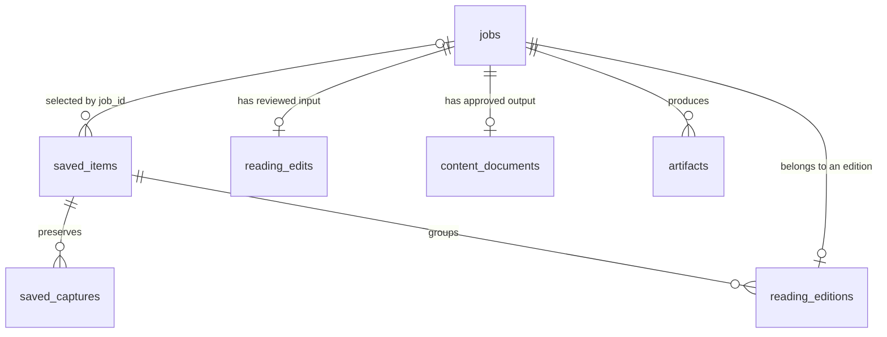

# PostgreSQL migrations

PostgreSQL 14+ stores Attic's canonical saved items, document jobs, capture
metadata and durable work queues. The schema needs no PostgreSQL extensions.
Capture and PDF bytes live in the artifact volume; Meilisearch holds a rebuildable
search projection. `saved_items.version`, `indexed_version` and `search_deletions`
track pending index work in PostgreSQL.

## Version and runner contract

- Files use a zero-padded numeric prefix: `NNNN_name.up.sql` and
  `NNNN_name.down.sql`.
- `internal/postgres/migrations.go` discovers and applies only **up** migrations,
  in numeric order, recording version and name in `schema_migrations`.
- Each migration runs in its own transaction. A version is recorded in that
  transaction, so a failure cannot mark a partially applied file as complete.
- Each transaction, including creation of the bookkeeping table, takes
  `pg_advisory_xact_lock(874611204)` on the same database connection. Concurrent
  startup is serialized; PostgreSQL releases the lock if the process exits.
- Startup rejects unknown applied versions, mismatched names and gaps in the
  applied history. An older binary cannot start against newer migrations it
  does not contain, even if the SQL changes appear backward-compatible.
- Temporal columns use `timestamptz`; application timestamps use UTC.

Down files are supplied for reviewed, manual rollback; there is no automatic
down-migration command. A manual rollback must coordinate application shutdown,
SQL changes, migration bookkeeping and artifact storage. Prefer restoring a
matching database and volume backup when reverting an incompatible release.

## Migration history

| Version | Change |
| --- | --- |
| 0001 | Document jobs, immutable approved content, artifact metadata, idempotency, AI/delivery attempts and deletion tasks. |
| 0002 | Additional safe AI-attempt error categories. |
| 0003 | The `pdf_quality_failed` job failure category. |
| 0004 | Durable email destination, pending/retry state and reusable Message-ID lookup. |
| 0005 | Saved items, capture history, browser bookmark sources, deletion tombstones and search synchronization; adopts existing URL jobs. |
| 0006 | Prefer an available existing document over a failed newer attempt during adoption. |
| 0007 | Distinguish server and browser capture sources. |
| 0008 | Reading editions associate jobs with saved items and target languages. |
| 0009 | Merge existing suggested tags into editable tags, preserving chosen tags and their order. |
| 0010 | Store owner-reviewed reading drafts for new document jobs. |

## Saved items and reading documents

A saved item survives capture, PDF or delivery failure. Captures are append-only
versions; reading editions link separate document jobs to the same item. The
selected job is referenced by `saved_items.job_id`. Changing the selected edition
or saving a reading edit does not overwrite earlier captures or PDFs.

The diagram shows the main foreign-key relationships; queue, attempt and browser
synchronization tables are omitted for clarity.

`reading_editions.language` is empty for the original edition or contains a
supported translation language. `reading_edits.draft` stores the sanitized,
owner-reviewed article used to generate that job's PDF without AI rewriting.

`content_documents` has at most one immutable document per job. A trigger rejects
updates; deletion still follows the job's foreign key. `artifacts` stores a
relative path, safe filename, media type, size, checksum and availability state,
with a unique output kind/profile per job. Capture artifact metadata is stored
in `saved_captures.artifact`; its bytes also live in the artifact volume.

IDs are opaque bounded `text` values generated by the application. Job stages,
statuses and failure categories use text checks rather than PostgreSQL enums.
Active processing and delivery require leases. Explicit email requests save the
destination at enqueue time; bookmarking does not enqueue email. Safe SMTP
retries reuse the attempt's stable Message-ID.

`ai_attempts` and `delivery_attempts` record safe operational outcomes, not prompts,
article bodies, screenshots, model responses, SMTP payloads or credentials.

## Deletion and indexes

Explicit item removal handles captures and associated document jobs, records a
URL tombstone to prevent routine browser reimport, and queues search deletion.
`deletion_tasks` retains relative file paths after job/artifact rows disappear:
its foreign keys use `ON DELETE SET NULL`. Job-owned content and attempt rows use
`ON DELETE CASCADE`. Filesystem cleanup can therefore retry independently.

Down migrations can discard data or refuse lossy rollback; review each file.
For example, 0002 maps newer error categories to an older safe category, while
0004 refuses to discard duplicate retry history. SQL rollback does not remove
files from the artifact volume.

Indexes support job pagination and lease claims, capture queues and history,
reading-edition lookup, and attempt/cleanup workers. The external search index is
rebuilt from saved-item metadata and text; see [search setup](../docs/search.md).
